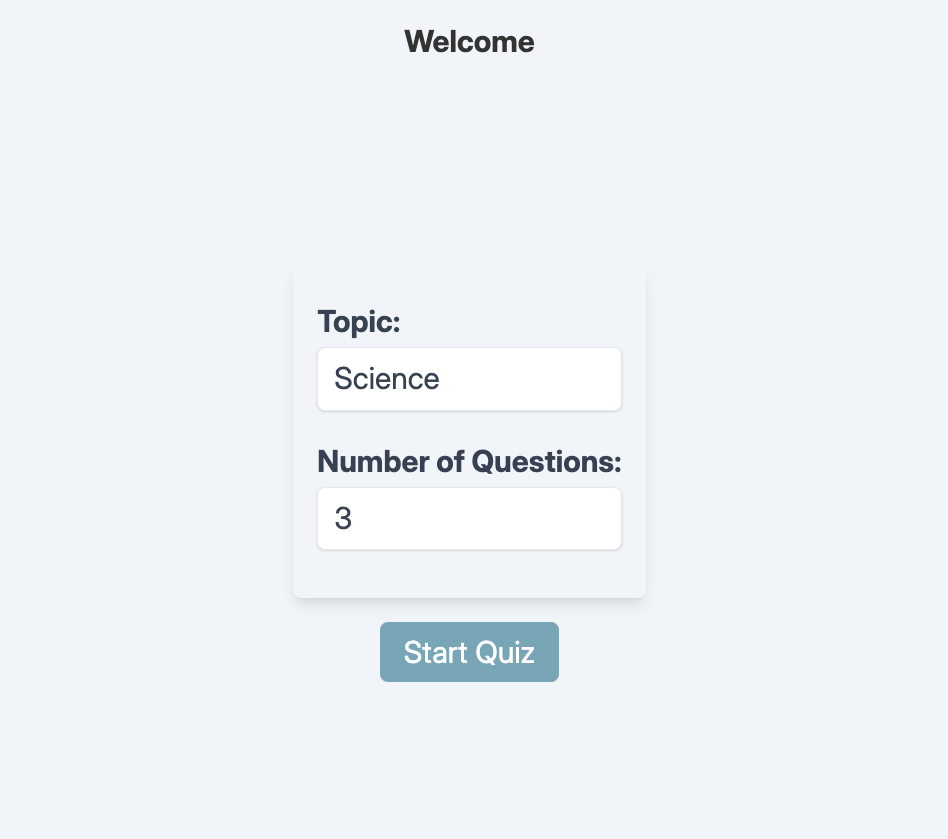
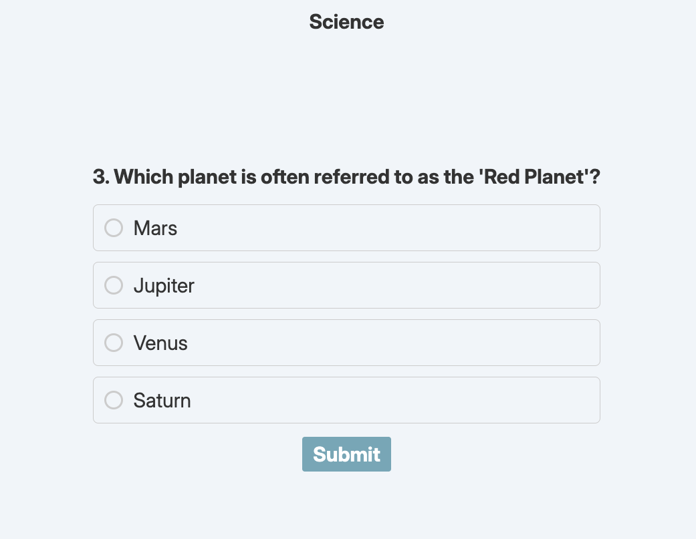
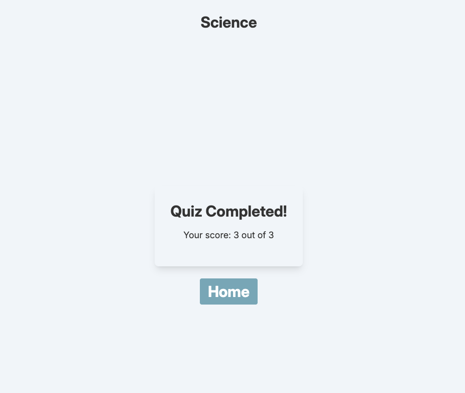

# Quiz App

- Vanilla HTML, JS (+jQuery), CSS.
- Questions in JSON format
- Only Multiple choice with single correct answer are supported.

## Quick Start
- Run with any HTTP Server. Example: `python3 -m http.server 3000`
- Vist http://localhost:3000

## Screenshots

### Home

### Question

### Score Card
